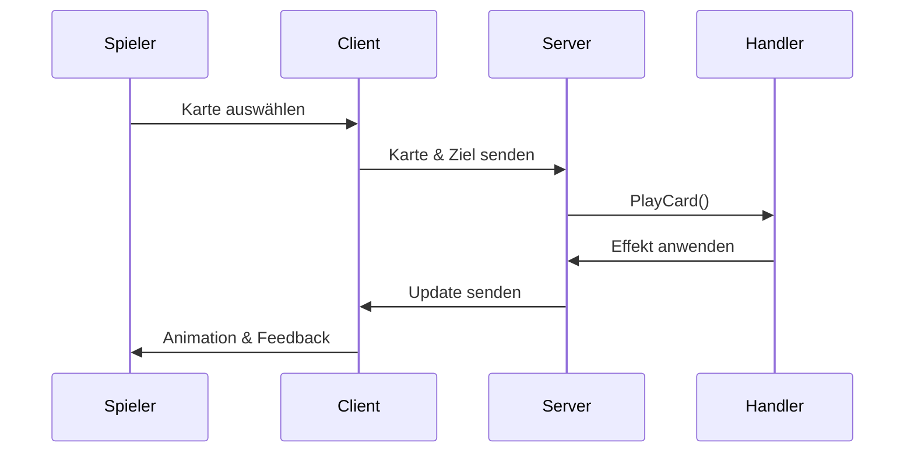
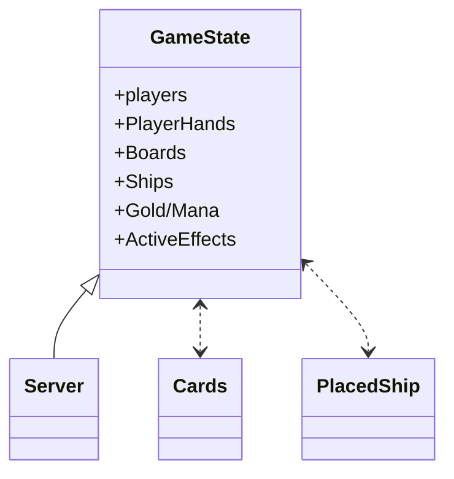
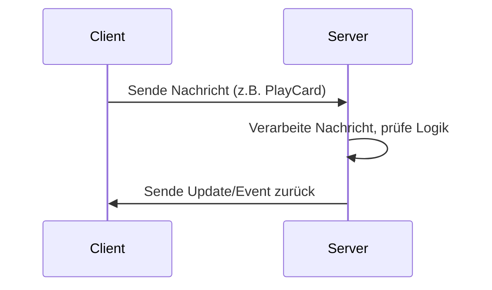

# Code-Präsentation WaterWizards

---


## Überblick
WaterWizards ist ein Multiplayer-Strategiespiel mit klarer Trennung von Client, Server und Shared-Code. Ziel ist eine robuste, erweiterbare und gut dokumentierte Codebasis.

**Technologien:**
- Programmiersprache: C#
- Grafik: Raylib (über Raylib-cs)
- Netzwerk: LiteNetLib
- Build/Analyse: .NET, DoxyGen, eigene Analytics

**Architektur:**
- Client (UI, Spiellogik, Netzwerk)
- Server (Matchmaking, Spiellogik, Netzwerk)
- Shared (gemeinsame Datenmodelle, Enums, DTOs)

```mermaid
classDiagram
    class Client
    class Server
    class Shared
    Client <..> Shared : nutzt
    Server <..> Shared : nutzt
    Client <---> Server : Netzwerk
```

---


## UI-Architektur
Die Benutzeroberfläche basiert auf Raylib und ist in verschiedene States gegliedert (Menü, Lobby, Spiel, GameOver). Die State-Maschine sorgt für einen klaren Ablauf und einfache Erweiterbarkeit.

**Codebeispiel: Einstiegspunkt (Program.cs)**
```csharp
static void Main()
{
    Raylib.InitAudioDevice();
    SoundManager.LoadSounds();
    Raylib.InitWindow(1200, 900, "Water Wizard");
    GameStateManager.Initialize(1200, 900);
    while (!Raylib.WindowShouldClose())
    {
        GameStateManager.Instance.UpdateAndDraw();
    }
    TextureManager.UnloadAllTextures();
    Raylib.CloseWindow();
}
```

**State-Maschine:**
```csharp
public interface IGameState {
    void Enter();
    void Update();
    void Draw();
    void Exit();
}
```

---


## GameScreen: Zentrale Spielfläche
Der GameScreen verwaltet Boards, Karten, Schiffe, Ressourcen und Effekte. Er ist das Herzstück der UI und bindet alle Spiellogik-Elemente zusammen.

**Codebeispiel: GameScreen-Konstruktor**
```csharp
public class GameScreen(
    GameStateManager gameStateManager,
    int screenWidth,
    int screenHeight,
    GameTimer gameTimer
)
{
    public GameBoard? playerBoard, opponentBoard;
    public GameHand? playerHand, opponentHand;
    // ... weitere Felder ...
}
```

**Beispiel: Karten ausspielen**
```csharp
public void PlayCard(Player player, Card card, Cell target) {
    if (player.Mana >= card.ManaCost) {
        CardHandler.ApplyEffect(card, target);
        player.Mana -= card.ManaCost;
    }
}
```

**Diagramm: Ablauf Kartenaktion**


---


## Shared: Gemeinsame Datenmodelle
Im Shared-Ordner liegen alle zentralen Datenmodelle, Enums und DTOs, die von Client und Server gemeinsam genutzt werden.

**Beispiel: Kartenmodell**
```csharp
/// <summary>
/// Repräsentiert eine einzelne Spielkarte mit Typ, Variante und zugehörigen Eigenschaften.
/// </summary>
public class Cards
{
    public CardType Type { get; private set; }
    public CardVariant Variant { get; private set; }
    public int Mana { get; private set; }
    public string? CastTime { get; private set; }
    public string? Duration { get; private set; }
    public CardTarget? Target { get; private set; }
}
```

**Beispiel: Enum CardType**
```csharp
public enum CardType
{
    Damage, // Schadenskarte
    Healing, // Heilkarte
    Environment, // Umgebungskarte
    Utility // Utility-Karte
}
```

**Beispiel: Cell und CellState**
```csharp
public class Cell
{
    public CellState CellState { get; set; }
}

public enum CellState
{
    Empty, Ship, Rock, Hit, Miss, Unknown, Thunder, HoveringEyeRevealed, Shield
}
```

---

## Patterns: Factory & Interfaces

### Factory-Pattern
Das Factory-Pattern wird genutzt, um die Erstellung von Kartenobjekten zu kapseln und zu vereinfachen. Für jede Kartenart gibt es eine eigene Factory, z.B. `DamageCardFactory`, `EnvironmentCardFactory`.

**Beispiel:**
```csharp
public static class DamageCardFactory {
    public static IDamageCard Create(CardVariant variant) {
        return variant switch {
            CardVariant.Firebolt => new FireboltCard(),
            CardVariant.FrostBolt => new FrostBoltCard(),
            // ... weitere Varianten ...
        };
    }
}
```
**Vorteil:** Neue Karten können einfach ergänzt werden, ohne die Spiellogik zu verändern.

### Interfaces
Interfaces wie `IDamageCard`, `IUtilityCard`, `IGameState`, `IServerGameState` sorgen für lose Kopplung und Austauschbarkeit.

**Beispiel:**
```csharp
public interface IDamageCard {
    void ApplyDamage(Cell target);
}

public class FireboltCard : IDamageCard {
    public void ApplyDamage(Cell target) {
        // Schaden anwenden ...
    }
}
```
**Vorteil:** Die Spiellogik kann mit beliebigen Kartentypen arbeiten, solange sie das Interface implementieren.

---


## Server/Backend
Der Server verwaltet Lobbies, Spielzustände, Kartenstapel, Ressourcen und synchronisiert alle Aktionen zwischen den Spielern.

**Codebeispiel: Server-Start (Program.cs)**
```csharp
static void Main()
{
    var server = new NetManager(listener);
    var gameStateManager = new ServerGameStateManager(server);
    gameStateManager.ChangeState(new LobbyState(server));
    // ...
    while (true) { /* Netzwerk-Events verarbeiten */ }
}
```

**Handler-Pattern:**
```csharp
public static void HandleAttack(NetPeer attacker, NetPeer defender, int x, int y)
{
    if (gameState.IsCoordinateProtectedByShield(x, y, defenderIndex))
    {
        SendAttackResult(attacker, defender, x, y, false, false);
        return;
    }
    // ... Schiffe prüfen, Schaden anwenden ...
}
```

**Lobby-Management:**
```csharp
public static Lobby CreateLobby()
{
    var sessionId = new GameSessionId();
    var lobby = new Lobby(sessionId);
    Lobbies[sessionId.SessionId] = lobby;
    return lobby;
}
```

### Spiellogik & GameSession
Die GameSession verwaltet den gesamten Zustand eines Spiels: Spieler, Boards, Kartenhände, Ressourcen, aktive Effekte und den aktuellen Spielstatus.

**Codebeispiel: GameState (Server)**
```csharp
public class GameState {
    public NetPeer[] players;
    public Dictionary<NetPeer, List<Cards>> PlayerHands;
    public List<Cards> UtilityStack, DamageStack, EnvironmentStack, HealingStack;
    public Dictionary<NetPeer, List<PlacedShip>> Ships;
    public int Player1Gold, Player2Gold;
    public Mana Player1Mana, Player2Mana;
    // ... weitere Felder ...
}
```

**Ablauf:**
- Beim Start werden Spieler, Boards und Kartenstapel initialisiert.
- Jede Aktion (z.B. Karte ausspielen, Angriff) verändert den GameState.
- Der Server prüft alle Regeln und synchronisiert den neuen Zustand mit den Clients.

**Diagramm: GameSession-Verwaltung**


**Vorteil:**
- Der gesamte Spielzustand ist zentral und konsistent auf dem Server verwaltet.
- Clients erhalten nur die für sie relevanten Updates.

---


## Kommunikation zwischen Backend und Client
Die Kommunikation erfolgt über LiteNetLib und basiert auf Events und Nachrichten. Jede Aktion (z.B. Kartenkauf, Angriff, Schiffsplatzierung) wird als Nachricht serialisiert und übertragen.

**Ablauf:**
1. Client erstellt eine Nachricht (z.B. "Karte ausspielen") und serialisiert sie.
2. Nachricht wird an den Server gesendet.
3. Server verarbeitet die Nachricht, prüft Logik und sendet ggf. Updates an beide Clients.

**Codebeispiel: Nachricht senden (Client)**
```csharp
public void SendMessage<T>(T message) where T : INetworkMessage {
    // Serialisierung und Versand
}
```

**Codebeispiel: Nachricht empfangen (Server)**
```csharp
listener.NetworkReceiveEvent += (fromPeer, dataReader, deliveryMethod) => {
    string messageType = dataReader.GetString();
    switch (messageType) {
        case "PlayCard":
            CardHandler.HandleCardCasting(...);
            break;
        // ... weitere Nachrichten ...
    }
};
```

**Diagramm: Nachrichtenfluss**


**Synchronisation:**
- Alle wichtigen Spielereignisse werden sofort an beide Clients gesendet.
- Fehler (z.B. zu wenig Ressourcen) werden explizit behandelt und führen zu klaren Rückmeldungen.

---

